#TedX QuaideSaintOuen Project

##### A Showcase website to represent the events and talks for each year.
How to use ?

1- `composer install`

2- create a .env.local and paste the .env inside it without forgetting to complete the database user, pwd and name of the db

2- `php bin/console doctrine:database:create`

3- `php bin/console make:migration`

4- `php bin/console doctrine:migrations:migrate`

## The Team

* Lisa Michel | [Github](https://github.com/Lisa-Mhl)
* Johnny Léger | [Github](https://github.com/Suckao)
* Elhadj Bah | [Github](https://github.com/Elhadj75BAH)
* Aurélien André | [Github](https://github.com/Krilline)

## Technos

* HTML
* CSS
* PHP
* Twig
* Symfony
* JavaScript

## Functionalities

####Front
* Nav-bar
    * Logo TedX QuaideSaintOuen (Home)
    * Talks
    * Partners (Partenaires)
    * Teams (Equipes)
    * Speakers
* Home (Accueil)
    * Banner of the event
    * Our values (Nos valeurs)
        * Display all articles
    * Stats
    * Feedbacks (Avis)
        * Display all feed backs
        * Form to add some
    * Our Partners (Nos Partenaires)
        * Display all partners
    * About us (A propos de nous)
        * About TedX
* Talks
    * Search bar with auto completion
    * Display all talks
* Partners (Partenaires)
    * Display all partners sorted by years
    * Contact form on page bottom
* Teams (Equipes)
    * Display all team members sorted by categories
* Speakers
    * Display all speakers
        * Details of the speaker by clicking on the picture
        * Biography
        * Link to social media (En savoir plus)
* Footer
    * About us (A propos de nous)
        * Partners (Partenaires)
        * Contact (Form)
        * Legal Mentions (Mentions légales)
    * Social Networks (Réseaux sociaux)
        * Display all social links
    * Newsletter form
    * Logo TedX QuaideSaintOuen
    
####Back
Can be accessed with /admin
* Easy-Admin
    * All entities can be managed
    * Images can be uploaded from the desktop using Vich Upload
## Graphic Chart

* Link | [Graphic Chart](https://dochub.com/krillinee/bDa8NX3RdXo849lR2zA6Ey/charte-graphique-tedx-pdf?dt=QXvLFkz1zsJefziBCBxy)

## WireFrame

* Link | [WireFrame](https://dochub.com/krillinee/P0B76b3K6xq2Az0wn2y1Gg/wild-maquette-site-internet-tedxquaidesaintouen-pptx?dt=3DnhyfzpXQY3AyEhU13D)

## Desktop Version

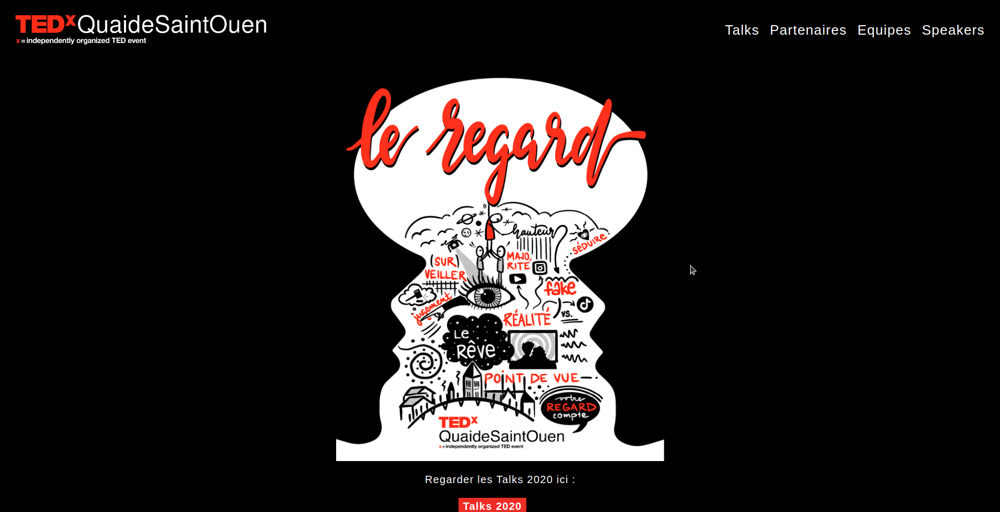
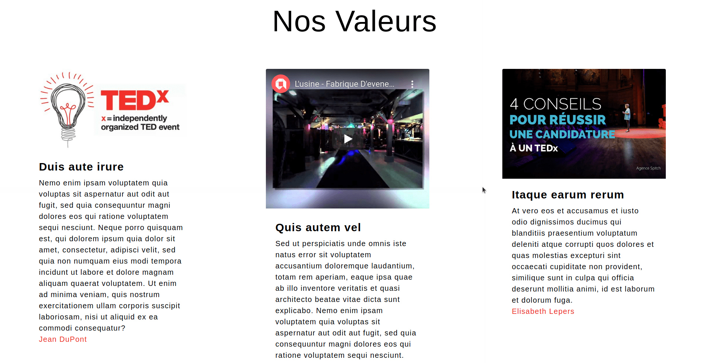
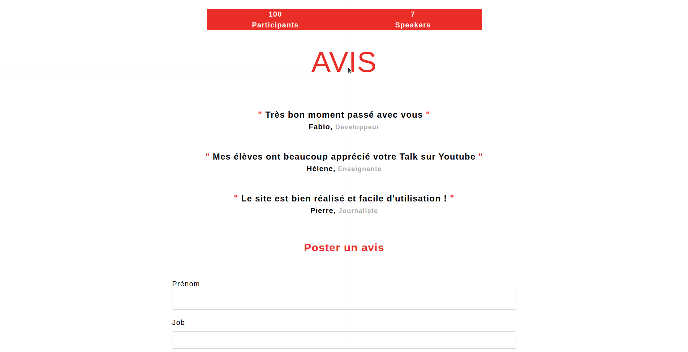
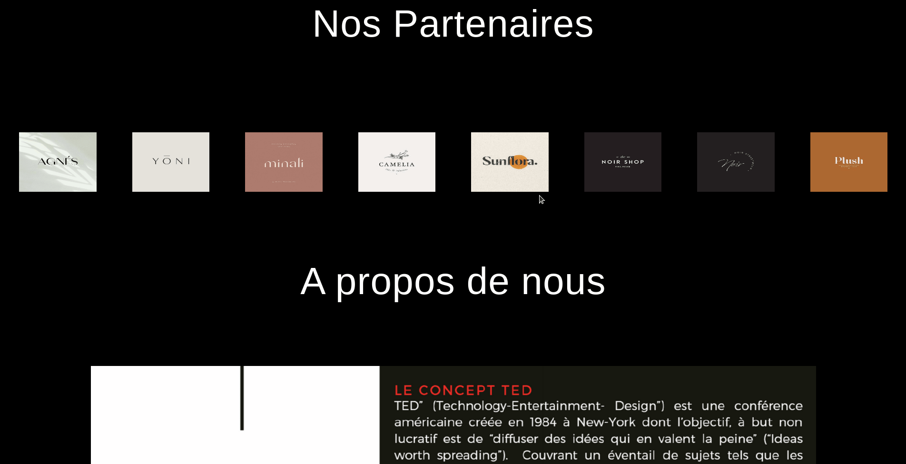
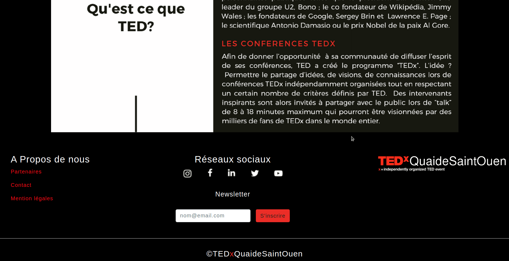

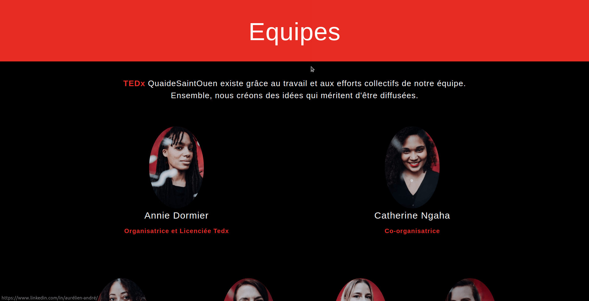
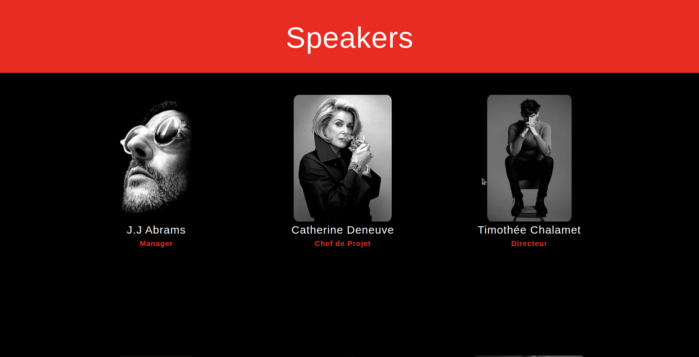

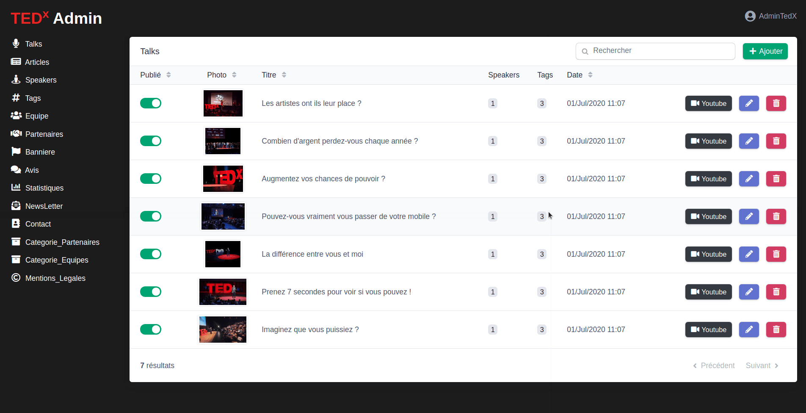

## Mobile Version

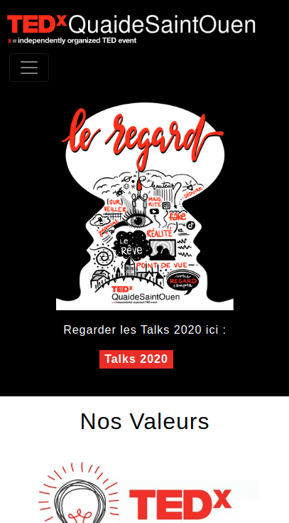
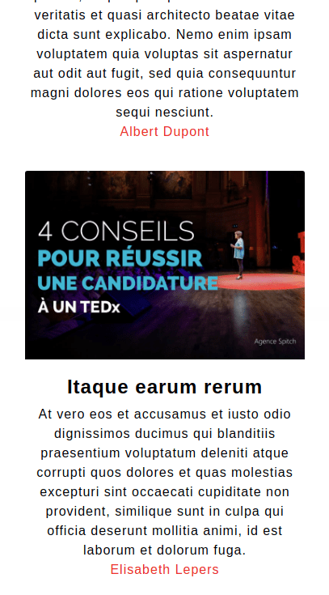
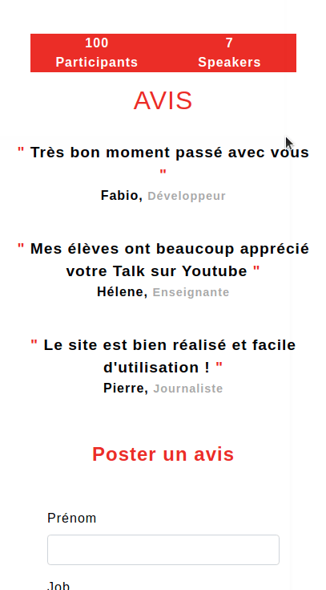
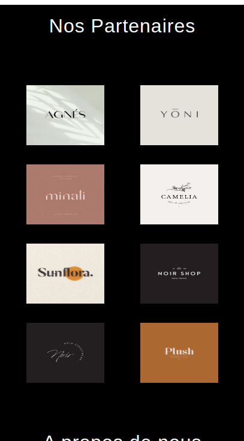
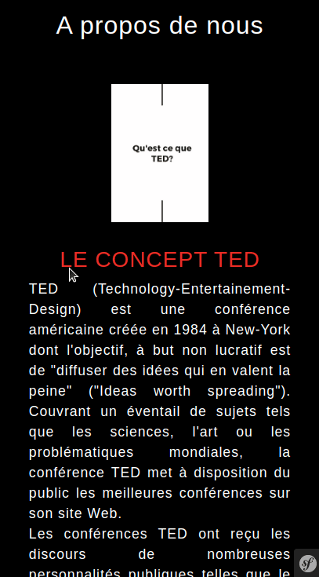
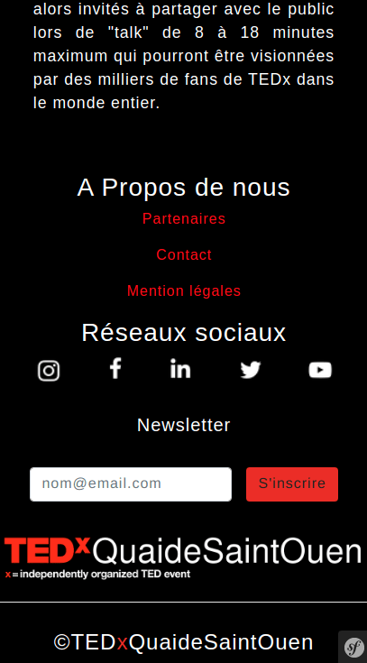
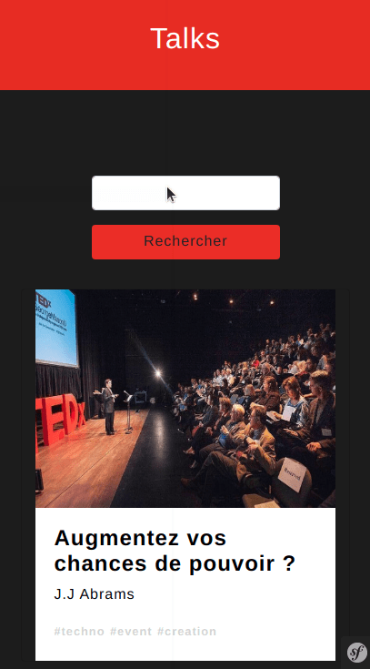
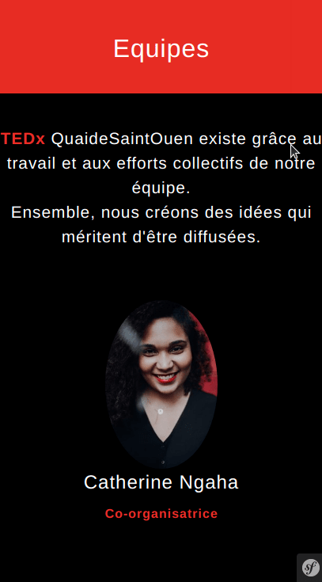
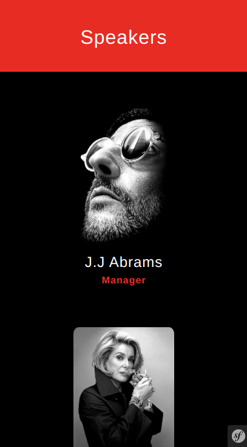
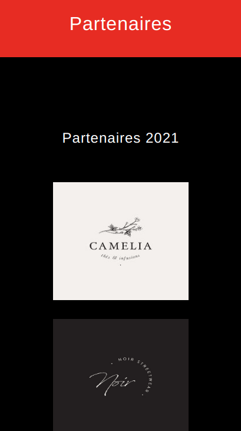
